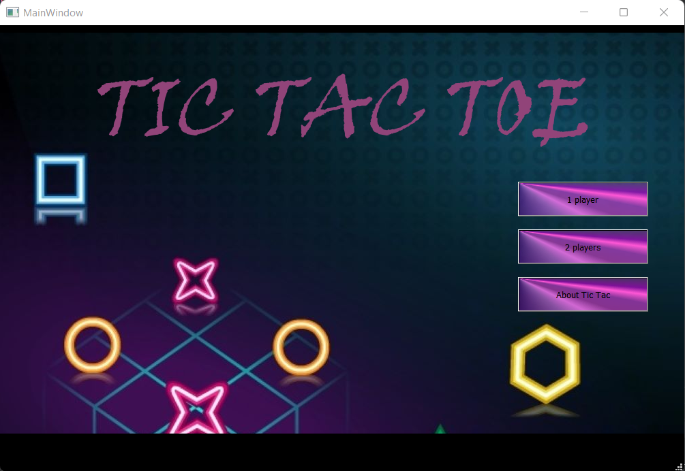
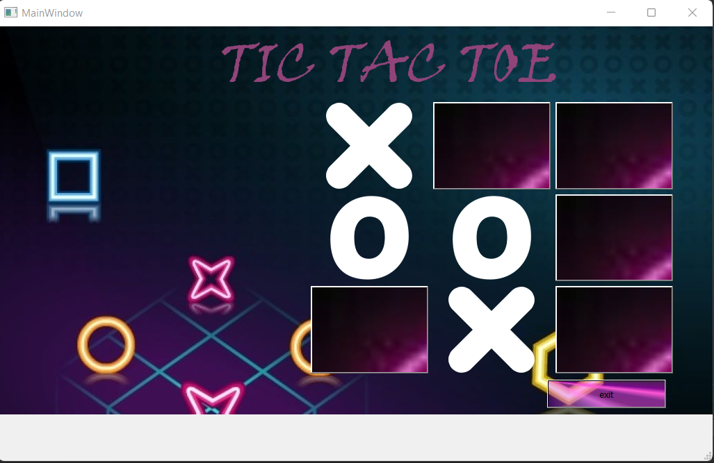
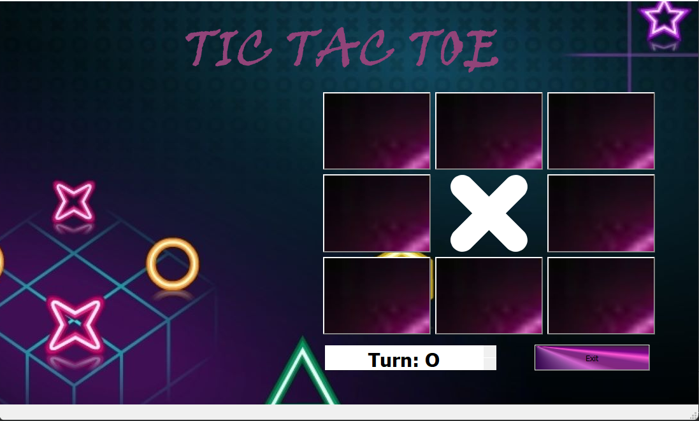
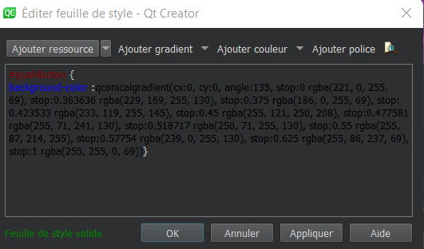
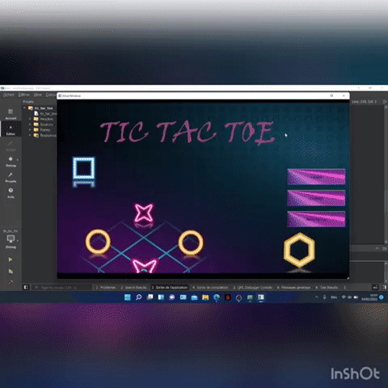

#                   * FINAL PROJECT *
              
_____
# INTRODUCTION 
Qt Designer is the Qt tool for designing and building graphical user interfaces (GUIs) with Qt Widgets. You can compose and customize your windows or dialogs in a what-you-see-is-what-you-get (WYSIWYG) manner, and test them using different styles and resolutions.

Widgets and forms created with Qt Designer integrate seamlessly with programmed code, using Qt's signals and slots mechanism, so that you can easily assign behavior to graphical elements. All properties set in Qt Designer can be changed dynamically within the code. Furthermore, features like widget promotion and custom plugins allow you to use your own components with Qt Designer.

## WHAT IS THE "Tic-tac-toe"
 is a game in which two players alternately put Xs and Os in compartments of a figure formed by two vertical lines crossing two horizontal lines and each tries to get a row of three Xs or three Os before the opponent does .


- **the image below represent our mainwindow , so it contains a frame in which we re going to set image background as we see here then 3 push buttons the first one redirect your to the vscomputer ui window the second one redirct you to two players mainwindow the third one gives you more details about the game**



- **the second   mainwindow is vscomputer mainwindow , so  we create a frame with the same background used before then we create 9 pushbuttons grouped in grid layout , and we create another one independently which is used to quit the grame**


- **Two player mainwindow has the same design of vscomputer window**

 
# NOW WE START THE CODING PART 
## **NOTICE** THAT EACH STEP IS COMMENTED 

```cpp
public:
    MainWindow(QWidget *parent = nullptr);
    ~MainWindow();

private slots:
    //The button that redirect you to the vscomputer  playing mode 
    void on_pushButton_clicked();
    //The button that redirect you to the two players  playing mode 
    void on_pushButton_2_clicked();
    //Message box giving you informations about the tic tac toe game 
    void on_pushButton_3_clicked();

private:
    Ui::MainWindow *ui;
    //constructor of twoplayers class
    twoplayers *two_players;
     //constructor of vscomputer class
    vscomputer *vs_computer;
};
#endif // MAINWINDOW_H

```


```cpp

#include "mainwindow.h"
#include "ui_mainwindow.h"


MainWindow::MainWindow(QWidget *parent)
    : QMainWindow(parent)
    , ui(new Ui::MainWindow)
{
    ui->setupUi(this);
    two_players = new twoplayers();
    vs_computer = new vscomputer();
}

MainWindow::~MainWindow()
{
    delete ui;
}


void MainWindow::on_pushButton_clicked()
{
  //to hide the current window  
    this->hide();
    //then showing the vscomputer window
    vs_computer->show();
}

void MainWindow::on_pushButton_2_clicked()
{
 
    this->hide();
    two_players->show();

}

void MainWindow::on_pushButton_3_clicked()
{
//Message box giving you details about tic tac toe 
        QMessageBox::about(this, "About tic tac toe", "Game in which two players alternately put Xs and Os in compartments of a figure formed by two vertical lines crossing two horizontal lines and each tries to get a row of three Xs or three Os before the opponent does .");
}
```
 Concerning the stylesheet , As we can see below , we have modified the style of buttons , frames ,labels using some CSS syntax : 


______________
 
As we know to play the **Tic-tac-toe** we must have two players 
so that's why we created the two classes  :
-
* **Vscomputer** ( play against the computer )
* **Twoplayers** ( play against you're friend )


 * ### In this part, we have to write a code to implement the first version of the Tic Tac Toe game which allows a human player to play against the computer that will acquire a kind of intelligence as it has known the game rules to win and not to loose. 

In order to achieve this part goal, we have to follow these steps :

- **Firstly, we declare our methods and variables in *vscomputer.h* :**
```cpp

class vscomputer : public QMainWindow
{
    Q_OBJECT

public:
    explicit vscomputer(QWidget *parent = nullptr);
    ~vscomputer();

private:
    Ui::vscomputer *ui;
    enum pos{
        CROSS = 2,
        CIRCLE = 1,
        NONE = 0
    };
    //define the positions that we have 
    pos positions[3][3] = {{NONE, NONE, NONE}, {NONE, NONE, NONE}, {NONE, NONE, NONE}};
    bool turn = true;//indicates if it is the  player's turn
    bool setPositions(int number);//set X or O in a position
    bool computerWins();//the move of the match
    bool computerNotLoosing();//to avoid the loss of the computer
    bool computerPassiveMove();
    void isSuccessful();//Check the game winner
    void computerTurn();
   ```
  - **Secondly, we declare a set of buttons slots and methods in *vscomputer.h* :**
```cpp 
private slots:
//declaring our slots 
    void on_button1_clicked();
    void on_pushButton_clicked();
    void on_textEdit_copyAvailable(bool b);
};

#endif // vscomputer_H
 ```
- Before we implement these methods and slots, let's talk about each one role:
  
    - **computerWins()**: the computer will be able to make the winning move.
    - **computerNotLoosing()**: the computer will make the move that avoid it the lost.
    - **computerPassiveMove()**: the computer will put O in a given position in case  where there is not a probabilty to win or loose.
    - **isSuccessful()**: to test the game result: X or O wins or there is a draw match.
    - **setPositions()**: to set X or O in a given position.
    - **computerTurn()**: to set the turn to computer.
    - **Buttons Slots**: to perform certain behave once a button is clicked
    - **Exit Slot**: quit the application once the *Exit* button is clicked.


- Secondly, we implement these methods and slots in *vscomputer.cpp*:

   **Notice that each part of the code is explicated in comment** 
```cpp
#include "vscomputer.h"
#include "ui_vscomputer.h"

vscomputer::vscomputer(QWidget *parent) :
    QMainWindow(parent),
    ui(new Ui::vscomputer)
{
    ui->setupUi(this);
}

vscomputer::~vscomputer()
{
    delete ui;
}
/*
 * [1,1 (1)]       [1,2 (2)]         [1,3 (3)]
 * [2,1 (4)]       [2,2 (5)]         [2,3 (6)]
 * [3,1 (7)]       [3,2 (8)]         [3,3 (9)]
 *positions
 *
 */
bool vscomputer::computerWins()
{
    //FILL IN POSITION 1 WITH O TO WIN BY THE 1ST ROW
    if(positions[0][0] == pos::NONE && positions[0][1] == pos::CROSS && positions[0][2] == pos::CROSS)
    {
        setPositions(1);
        return true;
    }
    //FILL IN POSITION 2 WITH O TO WIN BY THE 1ST ROW
    else if(positions[0][0] == pos::CROSS && positions[0][1] == pos::NONE && positions[0][2] == pos::CROSS)
    {
        setPositions(2);
        return true;
    }
    //FILL IN POSITION 3 WITH O TO WIN BY THE 1ST ROW
    else if(positions[0][0] == pos::CROSS && positions[0][1] == pos::CROSS && positions[0][2] == pos::NONE)
    {
        setPositions(3);
        return true;
    }

    
    }
    return false;
}
```
- **Concerning the other positions,the same things will be repeated  so no need to write the whole code.**

- **That was all about computerwins function ,now let´s move to Computernotloosing which specifies :**

          - not loosing in the rows
          - not loosing in the columns 
          - not loosing in the diagonal 
```cpp 
bool vscomputer::computerNotLoosing()
{
    //Not loose in the 1st row
    if(positions[0][0] == pos::NONE && positions[0][1] == pos::CIRCLE && positions[0][2] == pos::CIRCLE)
    {
        setPositions(1);
        return true;
    }
    else if(positions[0][0] == pos::CIRCLE && positions[0][1] == pos::NONE && positions[0][2] == pos::CIRCLE)
    {
        setPositions(2);
        return true;
    }
    else if(positions[0][0] == pos::CIRCLE && positions[0][1] == pos::CIRCLE && positions[0][2] == pos::NONE)
    {
        setPositions(3);
        return true;
    }
```
- **Same thing will be applied for the 2nd and the 3rd row , let´s see the column**

```cpp
 
    //Not loose in the 1nd column
    else if(positions[0][0] == pos::NONE && positions[1][0] == pos::CIRCLE && positions[2][0] == pos::CIRCLE)
    {
        setPositions(1);
        return true;
    }
    else if(positions[0][0] == pos::CIRCLE && positions[1][0] == pos::NONE && positions[2][0] == pos::CIRCLE)
    {
        setPositions(4);
        return true;
    }
    else if(positions[0][0] == pos::CIRCLE && positions[1][0] == pos::CIRCLE && positions[2][0] == pos::NONE)
    {
        setPositions(7);
        return true;
    }
    
```
- **The diagonal part :**
```cpp
    //Not loose in the diagonal
    else if(positions[0][2] == pos::NONE && positions[1][1] == pos::CIRCLE && positions[2][0] == pos::CIRCLE)
    {
        setPositions(3);
        return true;
    }
    else if(positions[0][2] == pos::CIRCLE && positions[1][1] == pos::NONE && positions[2][0] == pos::CIRCLE)
    {
        setPositions(5);
        return true;
    }
    else if(positions[0][2] == pos::CIRCLE && positions[1][1] == pos::CIRCLE && positions[2][0] == pos::NONE)
    {
        setPositions(7);
        return true;
    }
    return false;
}

```  
- **computerPassiveMove** generate the moves of the computers in front off your moves 
```cpp
bool vscomputer::computerPassiveMove()
{
        if(setPositions(5))
            return true;
        else if(setPositions(4))
            return true;
        else if(setPositions(6))
            return true;
        else if(setPositions(8))
            return true;
        else if(setPositions(2))
            return true;
        else if(setPositions(9))
            return true;
        else if(setPositions(1))
            return true;
        else if(setPositions(3))
            return true;
        else if(setPositions(7))
            return true;
        else
            return false;
}
```
- In Order to test if the X or the O win , we use the function isSuccessful that test each case of winning :
```cpp
void vscomputer::isSuccessful()
{

     for(int i=0; i<3; i++)
     {
         //test if X wins horizontally
               if(positions[i][0] == pos::CROSS && positions[i][1] == pos::CROSS && positions[i][2] == pos::CROSS ){

                   QMessageBox::information(this,"Match Winner", "X won");
                   QApplication::exit();

                   }
               //test if X wins vertically
               if(positions[0][i] == pos::CROSS && positions[1][i] == pos::CROSS && positions[2][i] == pos::CROSS )  {

                   QMessageBox::information(this,"Match Winner", "X won");
                   QApplication::exit();

                   }
           }
//test if X wins diagonally
     if(positions[0][0]==pos::CROSS && positions[1][1]==pos::CROSS && positions[2][2]==pos::CROSS){
         QMessageBox::information(this,"Match Winner", "X won");
         QApplication::exit();

         }

     if(positions[2][0]==pos::CROSS && positions[1][1]==pos::CROSS && positions[0][2]==pos::CROSS){
         QMessageBox::information(this,"Match Winner", "X won");
         QApplication::exit();

         }

        for(int i=0; i<3; i++)
        {
            //test if O wins horizontally

                  if(positions[i][0] == pos::CIRCLE && positions[i][1] == pos::CIRCLE && positions[i][2] == pos::CIRCLE ) {

                      QMessageBox::information(this,"Match Winner", "O won");
                      QApplication::exit();
                    }
                  //test if O wins vertically
                  if(positions[0][i] == pos::CIRCLE && positions[1][i] == pos::CIRCLE && positions[2][i] == pos::CIRCLE ){
                          QMessageBox::information(this,"Match Winner", "O won");
                          QApplication::exit();

                          }
              }
        //test if O wins diagonally

        if(positions[0][0]==pos::CIRCLE && positions[1][1]==pos::CIRCLE && positions[2][2]==pos::CIRCLE){
            QMessageBox::information(this,"Match Winner", "O won");
            QApplication::exit();

            }
        if(positions[2][0]==pos::CIRCLE && positions[1][1]==pos::CIRCLE && positions[0][2]==pos::CIRCLE){
            QMessageBox::information(this,"Match Winner", "O won");
            QApplication::exit();

            }


          int draw =0;
   //loop to count the number of strokes
        for(int i=1;i<4;i++){
        for(int j=1; j<4;j++){
            if(positions[i-1][j-1] != pos::NONE){

                draw ++;
            }

        }
     }

  //test the draw match case
    if(draw == 9) {
         QMessageBox::information(this,"Draw Match", "You are equal");
          exit(0);
    }

  }

  ```
**setPositions this method will give the ability to put the image of X or O in any button you will clicked on**
  ```cpp
  
bool vscomputer::setPositions(int number)
{
    if(positions[(number-1)/ 3][(number-1) % 3] == 0)
    {
        if(turn)
            switch (number)
            {
            case 1:
                //set X on button 1
                ui->button1->setStyleSheet("QPushButton { image :url(:/X.png);background : transparent;}");

                positions[0][0] = pos::CROSS;
                break;
             //the same process in the 9 cases
                
            }
            
        else
            switch (number)
            {
            case 1:
                //set O on button 1
                ui->button1->setStyleSheet("QPushButton { image :url(:/O.png);background : transparent;}");

                positions[0][0] = pos::CIRCLE;
                break;
           //the same process in the 9 cases
            }
        turn= !turn;
        isSuccessful(); //check if there is a winner
        return true;
    }
    return false;

}
```
 **this function is going to give the computer turn which has the wins and not loosing part in the 9 buttons**
```cpp
void vscomputer::computerTurn()
{
    if(computerWins() || computerNotLoosing()) return;

    else while(!computerPassiveMove()) {}
}
//slots of there buttons that will be disabled once an X or O is placed on it and will allow the computer to play

void vscomputer::on_button1_clicked()
{
    if(setPositions(1)) computerTurn();
    ui->button1->setEnabled(false);
}

// we have the same structure in the 9 buttons


void vscomputer::on_pushButton_clicked()
{
    //to exit
    auto reply = QMessageBox::question(this,"Exit","Do you really want to exit?");

     if(reply == QMessageBox::Yes)
         qApp->exit();

}

```

   - **Also in this part, we have to write a code to implement the second version of the Tic Tac Toe game which allows a human player to play against the human player .**


   - Firstly we're going to declared our buttons with the function 

   **NB : X reffers to the index of buttons (1...9)**
   ```cpp
   private slots:
    void on_buttonX_clicked();

   ```
   - After that we declared our functions and variables 
   ```cpp
   public:
    explicit twoplayers(QWidget *parent = nullptr);
    ~twoplayers();
private:
    Ui::twoplayers *ui;
    enum pos{
        CROSS = 2,
        CIRCLE = 1,
        NONE = 0
    };
    pos positions[3][3] = {{NONE, NONE, NONE}, {NONE, NONE, NONE}, {NONE, NONE, NONE}};
    bool turn = true;//indicates if it is the  player's turn
    void is_successful();//Check the game winner
   ``` 


- In twoplayers.cpp we gonna see the implementation of each method used : 
     - 
     - let's start with   is_successful() : which treats the test of success positon : Horizontal success , vertical success or diagonal success

  **for example**

```cpp
  //test if X wins horizontally
              if(positions[i][0] == pos::CROSS && positions[i][1] == pos::CROSS && positions[i][2] == pos::CROSS ){

                  QMessageBox::information(this,"Match Winner", "X won");
                  QApplication::exit();

                  }
```
 **"on_buttonX_clicked()" this method will give the ability to put the image of X or O in any button you will clicked on**
   
   - **NB : X reffers to the index of buttons (1...9)**
   - **NB2 : we have a text edit that shows us if the turn X or O** 
```cpp
void twoplayers::on_buttonX_clicked()
{
    if(positions[0][0] ==pos::NONE)
    {
        if(turn)
        {
            ui->button1->setStyleSheet("QPushButton { image :url(:/X.png);background : transparent;}");

            positions[0][0] = pos::CROSS;
            ui->textEdit->setText("Turn: O");
        }
        else
        {
             ui->button1->setStyleSheet("QPushButton { image :url(:/O.png);background : transparent;}");
            positions[0][0] = pos::CIRCLE;
            ui->textEdit->setText("Turn: X");

        }
        ui->textEdit->setAlignment(Qt::AlignCenter);
        QFont font = ui->textEdit->font();
        font.setBold(true);
        font.setPointSize(18);
        ui->textEdit->setFont(font);
        turn = !turn;
    }
    is_successful();
    ui->button1->setEnabled(false);
}
```
 - **And in the last part we have the button to quit the game**
 ```cpp
void twoplayers::on_pushButton_clicked()
{
    auto reply = QMessageBox::question(this,"Exit","Do you really want to exit?");

     if(reply == QMessageBox::Yes)
         qApp->exit();
}

 ```

 # SIMULATION 
 ## VSCOMPUTER
 
 ## TWOPLAYERS
 

# CONCLUSION
 * In this semester we learned a lot of valuable knowledge with Qt Designer that made creating our programs more enjoyable , Learning how to effectively create layouts with Qt Designer can sky rocket your productivity, particularly when creating complex GUIs
 also Qt Designer give us more ideas to create diffrents ~~PROFESSIONAL~~ Project 
______________
|FULL NAME|FACULTY|MAIL|
|---------|-------|-----|
|BOUZIDI salah| AI|Salah.Bouzidi@eidia.ueuromed.org|
|BADAOUI meryem|AI|Meryem.Badaoui@eidia.ueuromed.org|
|NECHCHAD mouad|AI|Mouad.Nechchad@eidia.ueuromed.org|
_____________
